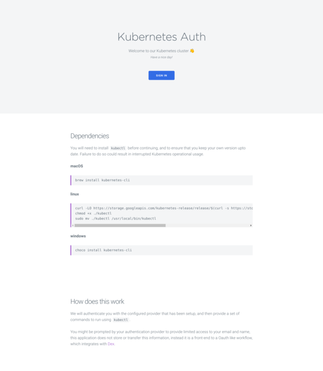
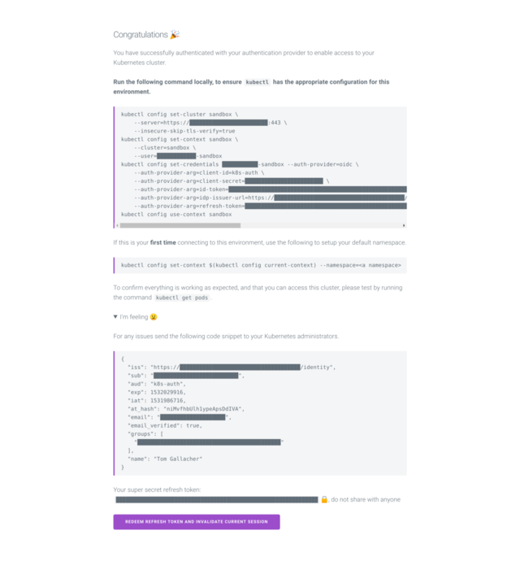

# kubernetes-auth

An authentication front-end to Kubernetes clusters, enabling users to log into
a Kubernetes cluster through the configuration and use of [Dex](https://github.com/coreos/dex),
[OIDC](https://github.com/coreos/dex/blob/5e34f0d1a6e22725b39f521178baac2cddd0a306/Documentation/openid-connect.md) 
and [Kubernetes OIDC](https://kubernetes.io/docs/reference/access-authn-authz/authentication/#openid-connect-tokens)

This has been developed for developers in large teams, with lots of new joiners to
provide an easy way to switch between environments / regions in non-federated
deployments.

It also provides an easy method to switch out Dex Connectors, so when your team
ends up moving from Github to Okta, you have a minimal set of changes to
implement.

### What does it look like?

Login Page            | Command Page
:-------------------------:|:-------------------------:
 | 

### I have a cluster, lets go!

[]()

Install dex:

```bash
helm upgrade --install dex ./charts/dex --set secrets.github.client.id=bleh --set secrets.github.client.secret=blah
```

Install kubernetes-auth:

```
helm upgrade --install kubernetes-auth ./charts/kubernetes-auth
```

Once the application has been deployed an running, the next step is to point
Kubernetes' OIDC options in the Kube API server.

```
--oidc-issuer-url=https://dex.sandbox.yld.io
--oidc-client-id=kubernetes-auth
--oidc-ca-file=/etc/kubernetes/ssl/openid-ca.pem
--oidc-username-claim=email
--oidc-groups-claim=groups
```

### Dex? Aka Kubernetes Authentication

Dex acts as an intermediary between Github authentication and Kubernetes acting
as an identity provider. This gives us the flexibility to move to another backed
(LDAP, SAML, etc.) at some point in the future.

At the moment user logins are federated by github teams. Each team then belongs
to a namespace with view on everything in that namespace. As time progresses we
might want to restrict / expand on this.

To Login a user will use the following flow, with sandbox being replaced by their
environment of choice (levels of access will be handled):

- Navigate to http://k8s-auth.sandbox.yld.io
- Login to Github and authorise the YLD github application
- Follow the instructions and Copy the kubeconfig to your local ~/.kube/config
- check access with `kubectl get pods`

### How does kubernetes-auth work with Dex?

We recommend reading the [Dex](https://github.com/coreos/dex) [Documentation](https://github.com/coreos/dex/blob/master/Documentation/using-dex.md) before continuing as it is
required to be working correctly before kubernetes-auth can start.

In our example helm chart for kubernetes-auth and dex, we specifically use only
the Github Connector and the PostgresSQL backend. This was the working combination
at time of implementation, but we plan to extend the chart to make it configurable.

For a Github Organisation as such:

- yldio
  - Team
    - platform
    - software-engineering

It becomes possible to map the team `platform` with the Kubernetes RBAC ClusterRole `cluster-admin` to give anyone in the team `platform` cluster-wide access to the kubernetes cluster. As such if we gave the team `software-engineering` a Role to a specific namespace, any new members will have access to the Kubernetes cluster in that specific namespace.

---

### Contribute

We're delighted that you'd like to contribute to kubernetes-auth, as we're always looking for ways to improve it.

If there is anything that you'd like to improve or propose, please submit a pull request. And remember to check the contribution [guidelines](CONTRIBUTING.md)!

#### Start

##### Dependencies

- Minikube
- kubectl
- helm

```bash static
echo $(minikube ip) cluster-auth.minikube.local | sudo tee -a /etc/hosts
minikube ssh 'echo 127.0.2.1 cluster-auth.minikube.local | sudo tee -a /etc/hosts'
helm upgrade --install dex ./charts/dex --set secrets.github.client.id=abcdef --set secrets.github.client.secret=abcedf
kubectl apply -f charts/dex/minikube.yaml
```

### License

[Apache-2.0](LICENSE)
